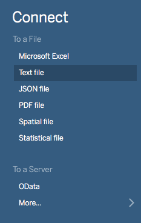
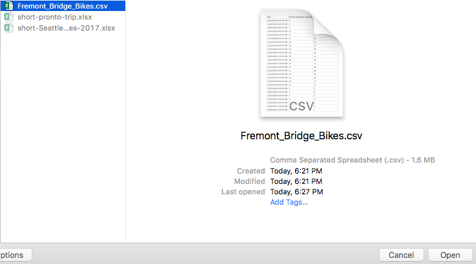
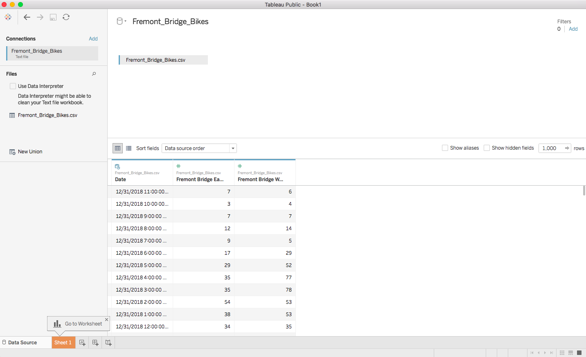
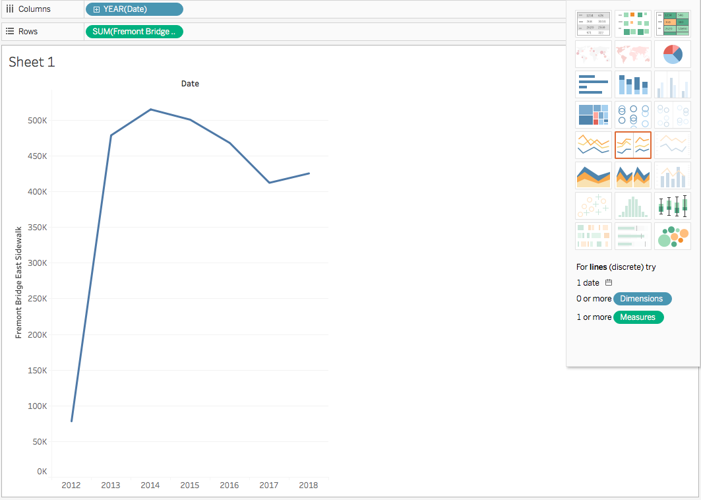
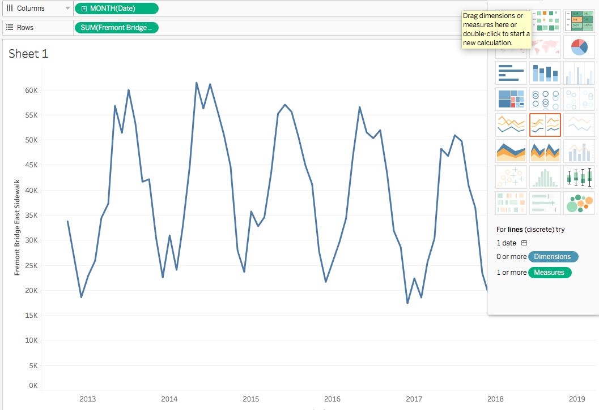
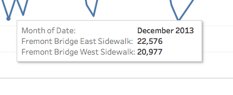
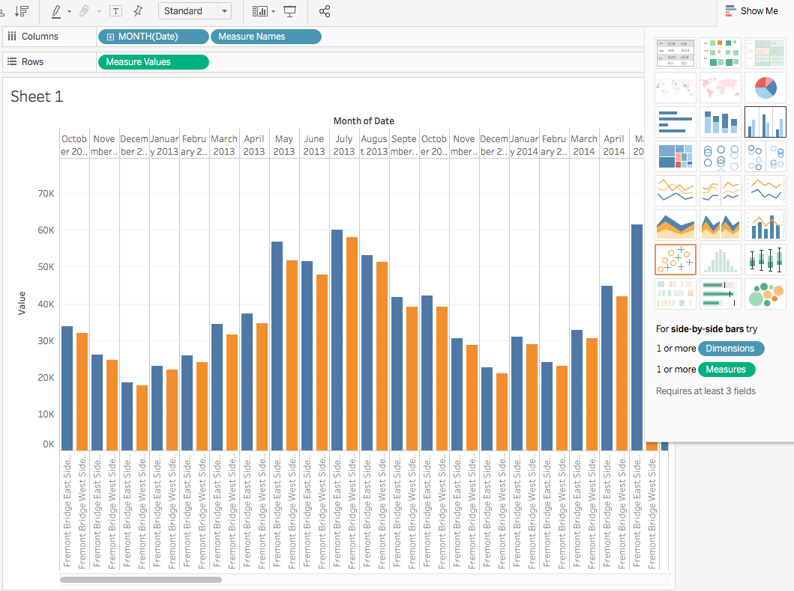
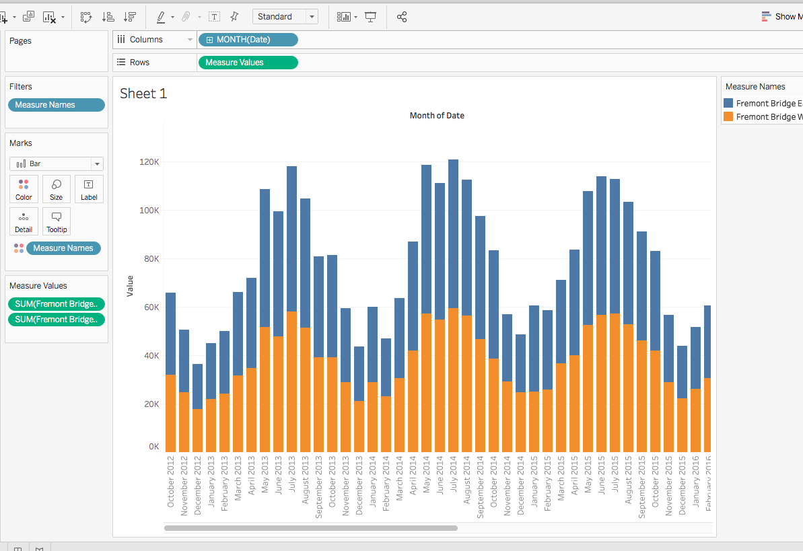

## Fremont Bridge Data Project

Launch Tableau!

### Connect to Data Source (Fremont)

The type of file is a Comma Seperated Value(CSV) Format. To open this in tableau under connect click `Text file`

Navigate to where you saved the data file. And click open

You should now see a screen similar to this:

Notice the data in the bottom half of the screen that looks like an excel sheet. This is a good opportinuty to explore our data a bit before going further with the visualization.

We can see this dataset is failr simple. It only contains three columns. 

- The date and hour
- Number of bikes on East sidewalk
- Number of bikes on the west Sidewalk

After we're done looking at our data lets click on the `sheet 1` near the bottom left

You should see a screen like this:

There are a lot of things going on here, lets may attention two parts right now:

- Columns and Rows

- Data
- - Dimension = Independant variable
- - Measure = Dependant variable

Measures can be grouped by Dimensions

Bike rides grouped by Month

Since we know we want to visualize by month lets drag `Date` data into the columns section. If you've used excel to make charts before this probably makes sense, usually you can think of columns as going left to right. Rows usually are going from top to bottom.

Sheet Example:

Lets drag one of the sidewalk Measures into Rows

Change to month

You may notice that our data in the columns section now turned green(measure) Why Month/Date changes to Measure

So from here we can actually already start seeing some insights about our data!

----

### Challenge: 
Even though we only have one of the sidewalks in our data we can start looking at some data:

What month has the lowest rides?
What month has the highest amount of rides?
Why do you think that is? Use you intuition!
Do you think the other sidewalk data will be the same?

----

Lets drag our other sidewalk data in the `rows` section.

Neat! We can see that they're similar looking, but slightly different!

Now if we hover over our lines the toolip displays values from both sidewalks. Tableau is gussing we would want to compare them!

This is pretty cool! I think we can actually start getting a lot out of this!

Lets make play around with different ways to visulize this data:

Select side by side bar chart

This actually isn't super terrible. We can see side by side how mnay rides there were for each month. 

But lets make this even cleaner!

Drag meausure names out of columns 

This gives a stacked chart. This actually may be useful if we want to see the combined amount of rides but still see what the split was like visually. 

It can still be a little hard to see how big the differenes are, lets make this a line chart. 

Instead of clicking show me to change the chart, this time we are going to click under the `Marks` section and select `line`

Now we can easily see the differences between each line (sidewalk).

Before we end this project lets poke around in tableau a little more!

Click on the `Analyitcs` tab right next to `Data`.

### Challenge
Click around on a few to explore different charts!
Are some better than others for answering different questions?

### Project Recap:
- import CSV files (what do we select)? 
- Measures vs dimensions (What are the differences?)
- How do we change chart types?

