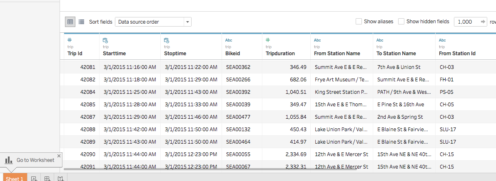
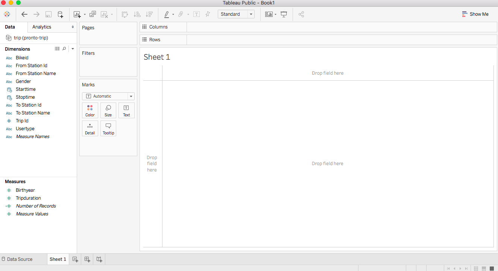
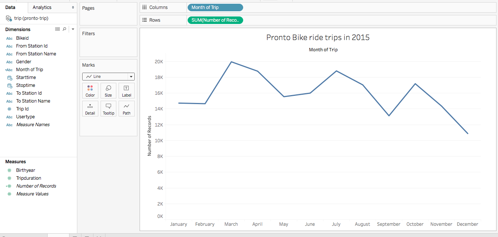

## Pronto Bikes Seattle

Seattle loves bike data! Lets use a lot of what we just learned in the previous section and do a quick analysis on this data!

In a time before LimeBikes and Jump there was once a bike company called [Pronto](https://en.wikipedia.org/wiki/Pronto_Cycle_Share) that inhabited Seattle. 

Our job as a Data Analyist is to figure out how many trips were take each month, and how to easily visulize those trips. What does the Trend of the number of rides per month look like?

### Importing Data (Pronto)

First we will need to import data. 

Select what type of data. In this case its Microsoft Excel(xls)

Navigate to where you saved the data and open the pronto-trp file

#### Explore your data (Pronto)

Know your data! Just like before, lets look at our data before going into visulizing our data.

------
#### Get to know your data!

Using the method described above, take a look at your data.
Think about some things we could get insights on. What colunms do you find the most interesting?

------

Click on `sheet 1`

The work area should be similar to this:

Lets drag in `nuumber of records`. Since each record is one ride we can use this number for total rides. 

For our columns we could just throw in start time, but it looks a bit messy. Also for learning purposes lets make a new `calculated field`!

Calculated fields allow you to make a new piece of data by combining or pulling from your current data. You may want to multiply unit price by units sold. Add multiple measures together. Or in this case we just want to pull the month from a date.

Right click in your dimension area. 

Select `Create New Calculated Field...`

Lets call ours Month of Trip

And we will use the `DATENAME` function to pull the name of the month from our start time data. 

`DATENAME("month", [Starttime])`

`Month of Trip` may end up in measures area. If so you can just drag it into dimensions.

Now lets drag `Month of trip` into the columns section. 

We can kind of see the tren from looking at the bar charts, but usually looking at a trend is better with a line

lets change that in our mark area. 

Cool! We can pretty clearly see the trend going down here!

### Project Recap:

- Calculated Fields (how do make them)?
- - What can we do with them?
- What do we slelect to import an excel sheet?
