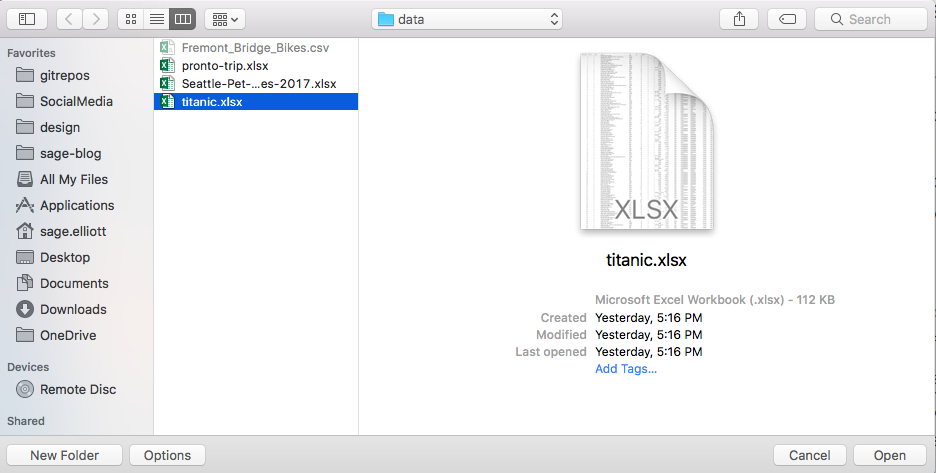
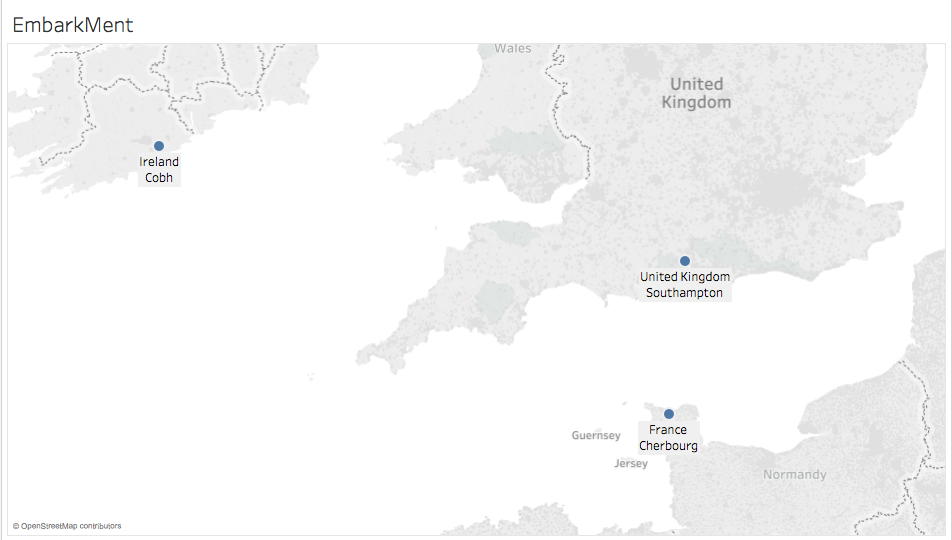
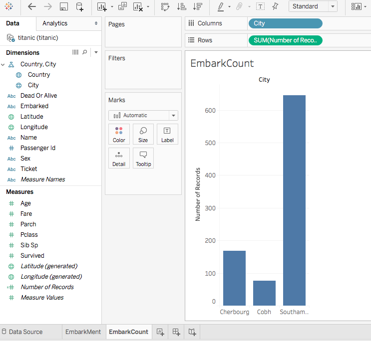

## Titanic 

### Importing Data (Titanic)

First we will need to import data. 

Select what type of data. In this case its Microsoft Excel(xls)

Navigate to where you saved the data and open the titanic file

#### Explore your data (Pronto)

Know your data! Just like before, lets look at our data before going into visulizing our data.

### EmbarkMap

Click on `sheet 1` to go to our workplace

This time we're going to use multiple sheets, so lets rename our `sheet1 `. We're going to call it `EmbarkMap`.

For this sheet we want to make a map!!!

Lets move Lets move `latitude` and `logitude` into dimensions. If we don't put them in dimensions it should actually still work in this example, but tableau will be trying to do a calulation on them. `AVG(latitude)`.

Lets populate our map!

- Drag `Logitude` into the columns sections

- Drag `Latitude` into the Rows Sections 

Cool we have a map!!! Lets add in the Country and city displayed on the map.

- Drag `Country` into the marks section

- Drag `City` into the marks section

- Click the dots to the left of them and select `label`

Our map should now show dots at the embarking point and the label of the country and city! We're done with it for now!

### EmbarkCount

Lets make a new sheet

And name it `EmbarkCount`. We want to get the number of people who left at each city. 

- Drag `City` to Columns
- Drag `Number of Records` to Rows(make sure is is SUM).

This gives us the count, but lets get even more data!

- Drag `Pclass` into dimensions
- Drag `Pclass` into color marks 

This is a cool break down showing the amount leaving from each city and how people were in first, second, and third class!

### Deaths

Make a new sheet and call it `Deaths`

- Drag `Pclass` into columns
- Drag `Dead or Alive`	iinto columns
- Drag `Number of Records` to Rows(make sure is is SUM).
- Drag `Pclass` into color marks

That was fast!

I hope you're begining to see how fast tableau can be!

### Dashboard

Dashboards are a place we can combine multiple sheets and charts in one place to tell a larger story!

Create a new dashboard. 

Lets call it `FullStory`

from the listed sheets Drag in `Embarkment` and `EmbarkCount`.

It looks a little squished. Lets adjust the size of our dashboard.

Lets put `1000` for now.

Drag in the remaining sheet

Toggle on highlighting slection

### Project Recap:

- What is a Dashboard?

